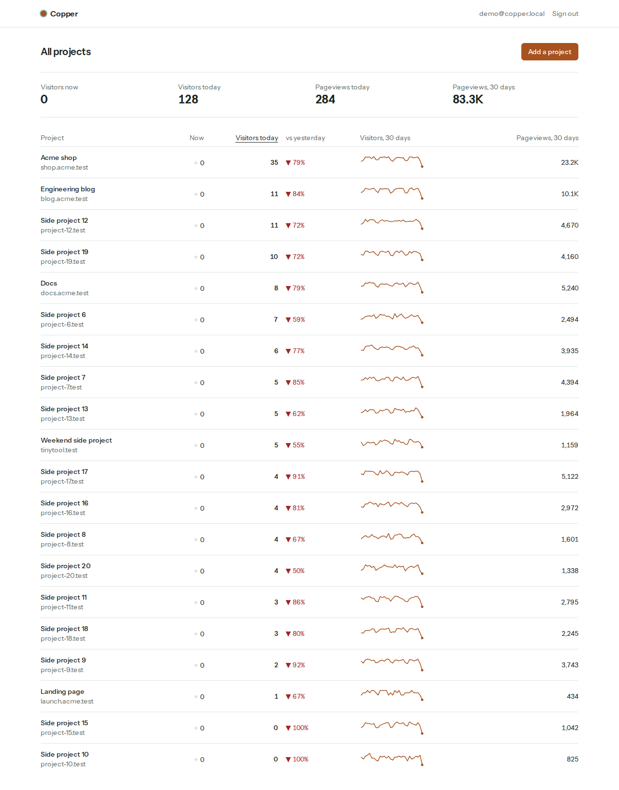
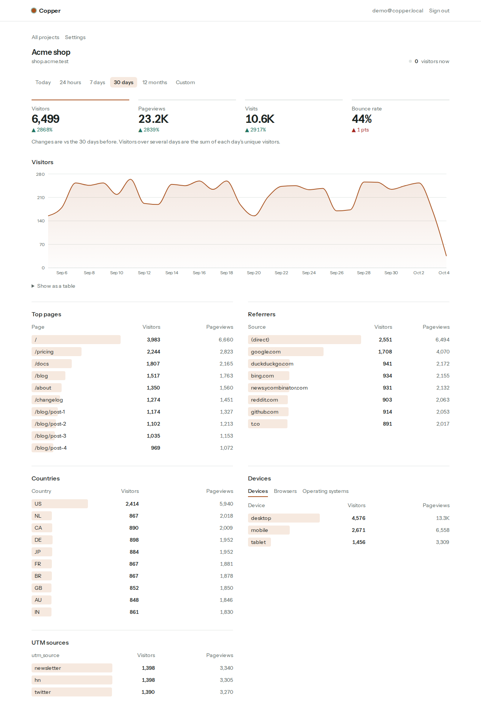
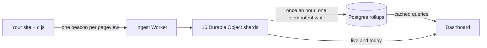

# Copper Analytics

Analytics for all your side projects, on one page, running at $0.

Copper is a cookieless, privacy-first traffic dashboard. One script tag per site, one overview for every site you run, and a design that fits 1,000 projects inside free database and hosting tiers.



## What you get

- **One overview for every project**: live visitors, today against yesterday, a 30-day trend.
- **The numbers that matter per project**: visitors, pageviews, visits, bounce rate, top pages, referrers, countries, devices, browsers, operating systems, UTM sources.
- **No cookies and no stored IP addresses**, so no consent banner.
- **A tracker under 1.5 KB** gzipped (482 bytes today) that follows single-page navigation.
- **Read-only share links, CSV export and a stats API** with per-project tokens.



## Quickstart

```bash
git clone https://github.com/masaok/copper-analytics.git
cd copper-analytics
docker compose up
```

Open <http://localhost:3000> and sign in as `demo@copper.local` with the password `copper-demo`. You get five projects with 30 days of sample traffic.

No Docker? Node 22 and pnpm are enough:

```bash
pnpm install
pnpm dev:db        # a local Postgres with nothing to install
cp .env.example apps/web/.env.local   # fill in the three required values, set COPPER_DEMO_LOGIN=1
DATABASE_URL=postgres://postgres@localhost:5433/postgres pnpm seed
pnpm --filter @copper/web dev
```

## Add it to a site

```html
<script defer src="https://your-copper-host/c.js" data-site="YOUR_SITE_KEY"></script>
```

Next.js, Astro and a same-origin proxy recipe are in [docs/SELF_HOSTING.md](docs/SELF_HOSTING.md#installing-the-tracker).

## Two ways to run it

| Mode | Runs on | Best for |
| --- | --- | --- |
| Simple | One Node process and any Postgres (Docker, Railway, a VPS) | A handful of sites |
| Edge | Next.js on Vercel, a Cloudflare Worker with Durable Objects, Neon Postgres | Hundreds to 1,000 sites on free tiers |

[docs/SELF_HOSTING.md](docs/SELF_HOSTING.md) covers both.

## How it stays at $0

Raw pageviews never reach Postgres. In edge mode they stop at Cloudflare:



- The Worker validates and enriches each pageview, then drops the IP address, user agent and full URL.
- Sixteen Durable Object shards hold the current hour in memory and write one SQLite row per 100 events.
- An hourly flush writes compact rollups: counters per hour and day, and the top 50 values per dimension per day as one JSON document.
- The dashboard reads history through a cache and reads the current hour straight from the shards, so most visits never wake the database.

The full design, with the storage and compute budget, is in [docs/PLAN.md](docs/PLAN.md).

## Repository layout

| Path | Holds |
| --- | --- |
| `apps/web` | The dashboard, auth, API routes and simple-mode ingest (Next.js) |
| `apps/ingest` | The Cloudflare Worker, Durable Object shards and hourly flush |
| `packages/core` | Aggregation, visitor hashing, top-N merge and enrichment, with no I/O |
| `packages/db` | Drizzle schema, SQL migrations and the Postgres store |
| `packages/tracker` | `c.js`, the browser script |
| `packages/ui` | Chart and table components |
| `packages/next` | `@copper-analytics/next` |

## Develop

```bash
pnpm install
pnpm verify   # lint, checks, typecheck, tests and the production build
```

[AGENTS.md](AGENTS.md) has the rules for changes, [docs/feature-map.md](docs/feature-map.md) lists every route with a command that reaches it, and [docs/guardrails.md](docs/guardrails.md) maps each rule to the check that enforces it.

## License

[MIT](LICENSE)
