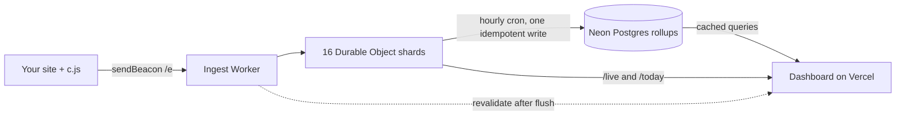

# Copper Analytics v2 build plan

Oct 3, 2026 · @Masao Kitamura

## Summary

Copper Analytics v2 is a cookieless, privacy-first, multi-project traffic dashboard at copperanalytics.com. It holds 1,000 projects inside Neon's free tier by never storing raw pageviews in Postgres: events land in Cloudflare Durable Objects, get aggregated there, and are flushed to Neon once an hour as compact rollups.

**Goals**

- One dashboard showing traffic across all of your projects, plus a simple per-project view.
- Only the necessities: visitors, pageviews, visits, bounce rate, top pages, referrers, countries, devices/browsers/OS, UTM sources, and a live visitor count.
- A tracking script under 1.5 KB gzipped, with no cookies and no IP addresses stored.
- Neon usage held under half of the free limits (storage under 500 MB, compute under 50 CU-hours a month) at 1,000 projects.
- A public repo, `copper-analytics`, that is self-hostable with one command and worth starring on its own; a private repo, `copper-analytics-cloud`, for production config, admin, and abuse rules.
- GitHub sign-in at launch; Google sign-in added later as a config change.

**Non-goals for v1:** cross-filtering (e.g. "referrers for /pricing only"), funnels, goals, user-level tracking, heatmaps, AI features.

**Stack:** pnpm workspaces + Turborepo, TypeScript (strict), Next.js (App Router) on Vercel, Cloudflare Workers + Durable Objects for ingestion, Neon Postgres with Drizzle ORM, Better Auth.

## Free-tier budget

Neon's free storage is 1 GB per project, not 500 GB: it was 0.5 GB until Neon doubled it on 2026-10-01. This plan budgets against the old 0.5 GB figure so it has 2x headroom. The other hard limit is compute: 100 CU-hours per project per month, and any query wakes the database for at least 5 minutes.

| Limit | Free allowance | v2 target | How we stay under it |
| --- | --- | --- | --- |
| Neon storage | 1 GB per project ([Neon FAQ](https://neon.com/faqs/free-plan-limits-and-quotas)) | < 500 MB worst case at 1,000 projects | Rollups only, top-N caps, tiered retention (see Data model) |
| Neon compute | 100 CU-hours / month | \~40 CU-hours | Fixed 0.25 CU; one batched write per hour; dashboard query cache |
| Neon network | 5 GB / month | < 1 GB | Rollup rows are tiny; dashboard results are cached |
| Cloudflare Workers requests | 100,000 / day | \~100k pageviews/day across all projects | One request per pageview; per-project daily caps |
| Durable Objects requests | 100,000 / day ([Cloudflare pricing](https://developers.cloudflare.com/workers/platform/pricing/)) | Same as above | 16 shards, not one object per project |
| Durable Objects rows written | 100,000 / day | < 20,000 / day | Micro-batches: one SQLite row per \~100 events or 5 s |

**Compute math (Neon, fixed 0.25 CU):** hourly flush ≈ 24 wakes × \~5 min = 2 h/day = 0.5 CU-h/day ≈ 15 CU-h/month. Dashboard use, assuming \~3 h/day of cumulative awake time, adds ≈ 23 CU-h/month. Nightly retention jobs ride along with a flush. Total ≈ 40 of 100.

**The real ceiling is total traffic, not project count.** On Cloudflare's free plan, ingestion tops out around 100,000 pageviews a day summed across all projects (\~3M a month). Past that, Workers Paid ($5/month) raises it to millions of requests; nothing in the design changes.

## Architecture

Three layers keep the database cheap: Cloudflare absorbs every pageview, Durable Objects hold the current hour in memory, and Neon receives one batched write per hour.



The dashboard reads history from Neon through a cache and reads today's partial hour and live visitors directly from the shards, so most dashboard visits never wake the database.

## Repo split

The public repo is the complete, self-hostable product; the private repo is a thin overlay that adds production wiring and anything that would help an attacker or leak operational detail. Production secrets live in Vercel, Cloudflare, and GitHub Actions secrets, never in either repo. Local secrets live in the private repo's gitignored `.config/` folder and are synced between machines with EnvStash.

**`copper-analytics` (public, MIT)**

```
copper-analytics/
  apps/
    web/          Next.js dashboard, docs, auth, API routes
    ingest/       Cloudflare Worker + Durable Object shards + cron flush
  packages/
    tracker/      c.js: the <1.5 KB browser script
    db/           Drizzle schema, migrations, typed queries
    core/         shared types, UA parsing, referrer normalization,
                  top-N merge, visitor hashing, default bot filter
    ui/           chart + table components (shadcn/ui + Recharts)
  docs/           PLAN.md (this doc), SELF_HOSTING.md
  .env.example    every variable, no values
  turbo.json, pnpm-workspace.yaml, biome.json
```

**`copper-analytics-cloud` (private)**

```
copper-analytics-cloud/
  upstream/       git submodule -> copper-analytics (pinned commit)
  apps/
    marketing/    copperanalytics.com: homepage, pricing, legal, blog
    admin/        admin.copperanalytics.com: users, projects, quotas,
                  storage + CU usage, kill switch per project
  packages/
    abuse/        stricter bot/spam rules, referrer-spam list, rate limits
  deploy/
    wrangler.production.toml   account id, routes, DO bindings, crons
    vercel.json overrides, DNS notes
  ops/            retention tuning, backup-to-R2 export, load-test script
  .github/workflows/  deploy ingest, deploy web, run migrations, nightly checks
  pnpm-workspace.yaml  includes upstream/apps/* and upstream/packages/*
```

**How they connect**

- The public ingest Worker exposes a `Filter` interface with a basic default (`isbot` + origin check). The private build swaps in `@copper/abuse` through a build-time alias in `wrangler.production.toml`.
- Production deploys run from the private repo's CI, building `upstream/` with private overrides. The public repo's CI only lints, type-checks, and tests.
- Bump the submodule to ship a public change; private-only changes never touch the public history.
- The admin app is a separate Next.js app on the same Neon database, gated to your GitHub user id.

The marketing homepage also lives in the private repo, as `apps/marketing`: a small, mostly static Next.js app deployed to `copperanalytics.com`. It holds the homepage, pricing/about, legal pages, and blog, so positioning copy and launch content stay out of the public history. See Domains and routing below.

**Two deploy modes in the public repo**

The public repo runs in two modes so self-hosters never need Cloudflare or Neon, while copperanalytics.com keeps the $0-at-scale path. Both modes share the same rollup, top-N, and hashing code in `packages/core`.

| Mode | Runs on | Ingestion | Best for |
| --- | --- | --- | --- |
| Simple | `apps/web` + any Postgres (Docker, Railway, Vercel + Neon) | API route `/api/e` with an in-process buffer flushed every few minutes | Self-hosters with a handful of sites |
| Edge | `apps/web` + `apps/ingest` on Cloudflare + Neon | Worker + Durable Object shards, hourly flush | Hundreds to 1,000 projects on free tiers (copperanalytics.com) |

- `packages/core` defines two interfaces: `EventBuffer` (in-memory or Durable Object) and `Store` (Drizzle on Postgres). Mode is picked by `COPPER_MODE=simple|edge`.
- Ship `Dockerfile`, `docker-compose.yml` (app + Postgres), a Deploy to Vercel button, and Wrangler templates for edge mode.
- `docs/SELF_HOSTING.md` covers both modes with a 5-minute quickstart.

## Data model and storage budget

Neon stores totals in narrow rows and breakdowns as one compressed JSONB document per project per day, which keeps 1,000 busy projects around 330 MB in the worst case. Postgres TOAST compresses JSONB over \~2 KB automatically, and fetching 90 small documents to merge in code is cheap.

**Tables**

| Table | Key | Columns | Retention |
| --- | --- | --- | --- |
| `user`, `account`, `session`, `verification` | Better Auth defaults | GitHub (later Google) identities | Forever |
| `project` | `id` int identity | `site_key` (public, 10-char nanoid), `owner_id`, `name`, `domains text[]`, `timezone`, `is_public`, `daily_cap`, `created_at` | Forever |
| `stats_hourly` | (`project_id`, `hour`) | `pageviews`, `visitors`, `visits`, `bounces` (int4) | 14 days |
| `stats_daily` | (`project_id`, `day`) | same four counters | Forever |
| `breakdown_daily` | (`project_id`, `day`) | `data jsonb`: top 50 per dimension + `(other)` | 90 days |
| `breakdown_monthly` | (`project_id`, `month`) | `data jsonb`: top 100 per dimension + `(other)` | 25 months |
| `flush_log` | (`shard`, `flush_id`) | `flushed_at` | 30 days |

Dimensions in `data`: `page`, `referrer` (domain), `country`, `device`, `browser`, `os`, `utm_source`. Each entry is `[pageviews, visitors]`, e.g. `{"page": {"/": [812, 430], "/pricing": [96, 71]}}`.

**Worst-case storage at 1,000 projects, all active, high cardinality**

| Data | Math | Size |
| --- | --- | --- |
| `stats_hourly` | 1,000 × 336 h × \~60 B | \~20 MB |
| `stats_daily` | 1,000 × 365 d × \~60 B, per year kept | \~22 MB / year |
| `breakdown_daily` | 1,000 × 90 d × \~1.5 KB compressed | \~135 MB |
| `breakdown_monthly` | 1,000 × 25 mo × \~3 KB compressed | \~75 MB |
| Auth, projects, flush log, indexes, overhead | — | \~50 MB |
| **Total** | year one, growing \~22 MB/year | **\~300–330 MB** |

Real usage will be far lower: most small sites have a handful of pages and referrers. A nightly guard job records `pg_database_size()` in the admin app and alerts at 60% of 1 GB; the lever if it ever trips is shortening `breakdown_daily` retention.

**Unique visitors, cookieless.** `visitor_id = first 8 bytes of SHA-256(daily_salt + site_key + ip + user_agent)`. The salt is random, held only in the Durable Object, and replaced every UTC midnight, so IDs cannot be linked across days and no IP is ever stored. Multi-day "visitors" is the sum of daily visitors, the same trade-off Plausible makes; label it in the UI.

## Ingestion and flush pipeline

Every pageview stops at Cloudflare; Neon is touched once an hour by a single batched, idempotent transaction.

**Tracker (`packages/tracker`, served as `copperanalytics.com/c.js`)**

```html
<script defer src="https://copperanalytics.com/c.js" data-site="k3x9q2m7ab"></script>
```

- Sends `{s: site_key, u: url, r: referrer, w: screen width}` with `navigator.sendBeacon` to `https://e.copperanalytics.com/e`.
- Tracks SPA navigation by wrapping `history.pushState` and listening to `popstate`.
- Skips `localhost`, `file:`, and pages with `data-copper-ignore`; honors an opt-out flag in `localStorage`.
- Docs include a first-party proxy recipe (Next.js rewrites, Vercel/Netlify redirects) because ad blockers may list any domain containing "analytics".

**Ingest Worker (`apps/ingest`)**

1. Validate: known `site_key` (cached project config from a 5-minute KV/in-memory cache, refreshed from Neon only on miss), `Origin` matches `project.domains`, payload size, not a bot (`Filter`).
2. Enrich at the edge, then drop the raw inputs: country from `request.cf.country`, device/browser/OS from the UA, referrer reduced to its domain, UTM source from the URL, path with query string stripped.
3. Compute `visitor_id` with the shard's daily salt, then forward a \~100-byte event to Durable Object shard `hash(site_key) % 16`.
4. Return `204` immediately.

**Durable Object shard (16 total, SQLite-backed)**

- Buffers events in memory; writes one SQLite row per micro-batch (100 events or 5 s, whichever first) so a restart loses at most seconds of data.
- Keeps a `seen_today` set per project to mark first-visit-of-the-day; sessions use a 30-minute inactivity window to compute `visits` and `bounces`.
- Enforces each project's `daily_cap` so one noisy site cannot eat the shared free quota.
- Answers `GET /live?site=` (visitors in the last 5 minutes) and `GET /today?site=` (current partial hour) straight from memory, so the dashboard shows fresh numbers without waking Neon.

**Hourly flush (Worker cron at minute 5)**

1. Cron calls each of the 16 shards: "aggregate everything before the top of the hour."
2. Each shard returns hourly counters plus top-N dimension maps per project, tagged with a `flush_id`.
3. The Worker opens one Neon transaction (Neon serverless driver over HTTP): insert `flush_log` row (conflict = already applied, skip), upsert `stats_hourly`, add into `stats_daily`, merge-into `breakdown_daily` JSONB.
4. Only after commit does the cron tell shards to delete the flushed batches. A failed flush is retried next hour with the same `flush_id`, so nothing is double-counted.
5. Once a day, the same run applies retention deletes, rolls finished months into `breakdown_monthly`, and records database size.

## Dashboard scope

The dashboard has four screens, and the cross-project overview is the first screen after sign-in because that is the reason this product exists.

| Screen | Route | What it shows |
| --- | --- | --- |
| All projects | `/dashboard` | One row per project: live visitors, today's visitors vs. yesterday (%), 30-day sparkline, pageviews. Sort by traffic or name. Totals across all projects at the top. |
| Project | `/p/[siteKey]` | Range picker (Today, 24h, 7d, 30d, 12mo, custom). KPI cards with % change: visitors, pageviews, visits, bounce rate. One time-series chart. Panels: top pages, referrers, countries, devices/browsers/OS (tabs), UTM sources. Live count in the header. |
| Project settings | `/p/[siteKey]/settings` | Name, allowed domains, timezone, install snippet + "verify install" check, public share link toggle, CSV export, delete. |
| Shared view | `/share/[siteKey]` | Read-only Project screen, only when `is_public` is on. |

**Domains and routing**

| Host | Serves | Repo |
| --- | --- | --- |
| `copperanalytics.com` | Marketing homepage, pricing/about, privacy, terms, blog/changelog; rewrites `/c.js` to the app | Private: `apps/marketing` |
| `app.copperanalytics.com` | Dashboard, sign-in, settings, shared views, `/docs`, `/c.js`, API | Public: `apps/web` |
| `e.copperanalytics.com` | Ingest Worker | Public code, private config |
| `admin.copperanalytics.com` | Admin app | Private: `apps/admin` |

In `apps/web`, `/` redirects signed-in users to `/dashboard` and shows a minimal sign-in page to everyone else. Self-hosters get the same behavior at the root of their own domain, with no marketing copy. The marketing site has no auth or database access; its Sign in button links to `app.copperanalytics.com`.

**Keeping compute low on the dashboard**

- Historical data changes only at the hourly flush, so server queries are cached (`unstable_cache` / `"use cache"` with a tag per project) and revalidated by the flush Worker calling `/api/revalidate`. Most page views never wake Neon.
- Today and Live come from the Durable Object endpoints, not Neon.
- Range queries read `stats_hourly` for ≤ 48 h, `stats_daily` beyond that; breakdowns read `breakdown_daily` for ≤ 90 days, `breakdown_monthly` beyond that, merged in `packages/core`.

**Auth and limits**

- Better Auth with the Drizzle adapter and GitHub OAuth; Google is a second provider block plus env vars.
- Default 10 projects per account (raise per user in admin) so 1,000 projects is a ceiling you control.
- Single owner per project in v1; the schema leaves room for a `project_member` table later.

## Build phases for Claude Code

Build in ten phases, each ending in something you can run and check. Export this doc as Markdown to `docs/PLAN.md` in both repos and start each Claude Code session with "Implement Phase N of docs/PLAN.md." All commands use pnpm.

**Phase 0: Repos and tooling**

- [ ] Create `copper-analytics` (public) with pnpm workspaces, Turborepo, TypeScript strict, Biome, Vitest, and the folder layout above.
- [ ] Create `copper-analytics-cloud` (private) with `upstream/` as a submodule and a workspace that includes upstream packages.
- [ ] CI: public = lint, typecheck, test; private = same plus deploy jobs (disabled until Phase 6).

* Done when `pnpm build` passes in both repos.

**Phase 1: Database and auth**

- [ ] Neon project with compute fixed at 0.25 CU (min = max), default 5-minute suspend.
- [ ] Drizzle schema + first migration for every table in the data model.
- [ ] Better Auth with GitHub; sign-in, sign-out, protected routes.
- [ ] Project CRUD with `site_key` generation and the 10-project limit.

* Done when you can sign in with GitHub and create a project that shows its install snippet.

**Phase 2: Tracker and ingest**

- [ ] `c.js` with SPA support; size check in CI fails above 1.5 KB gzipped.
- [ ] Ingest Worker: validation, enrichment, visitor hashing, `Filter` interface.
- [ ] Durable Object shards with micro-batching, sessions, `seen_today`, daily caps, `/live` and `/today`.

* Done when `wrangler dev` plus a test page shows live counts updating.

**Phase 3: Flush pipeline**

- [ ] Cron flush with `flush_id` idempotency and delete-after-commit.
- [ ] Tests: a replayed flush does not double count; a failed Neon write keeps data in the shard.

* Done when a full hour of synthetic traffic lands in `stats_hourly`, `stats_daily`, and `breakdown_daily` with correct totals.

**Phase 4: Dashboard**

- [ ] All-projects overview, project view, settings, shared view.
- [ ] Cached queries with flush-triggered revalidation.

* Done when the overview loads for 20 test projects without a Neon query on a repeat visit.

**Phase 5: Retention and guards**

- [ ] Daily retention deletes, monthly rollup, `pg_database_size()` recording.
- [ ] Load test: 1,000 projects × 30 simulated days of realistic traffic; confirm size stays under 500 MB and the hourly flush finishes in under 10 seconds.

* Done when the load-test report is committed to the private repo.

**Phase 6: Self-host mode and integrations**

- [ ] `EventBuffer` and `Store` interfaces; simple mode with ingestion as a Next.js API route.
- [ ] `Dockerfile`, `docker-compose.yml`, Deploy to Vercel button, `docs/SELF_HOSTING.md`.
- [ ] `@copper-analytics/next` package exporting `<CopperAnalytics siteKey="..." />`; Astro and plain-HTML snippets in docs.
- [ ] Read-only stats API with per-project tokens (`GET /api/v1/stats?site=&range=`).
- [ ] Seed script that generates 30 days of fake traffic for local development.

* Done when a fresh clone runs with `docker compose up` and shows seeded data in under 5 minutes.

**Phase 7: Cloud overlay and deploy**

- [ ] Private `abuse` package, admin app, production wrangler config, deploy workflows.
- [ ] DNS: `copperanalytics.com` and `admin.` on Vercel, `e.` on the Worker.
- [ ] Add Copper to copperanalytics.com itself and to your own projects.

* [ ] Build `apps/marketing` in the private repo (homepage, pricing/about, privacy, terms, blog) and its `/c.js` rewrite to the app.
* [ ] Point the apex domain at the marketing project and `app.` at the dashboard project on Vercel.

**Phase 8: Google sign-in**

- [ ] Add the Google provider and account linking by verified email.

**Phase 9: Launch and growth**

- [ ] README: one-sentence pitch ("Analytics for all your side projects, running at $0"), screenshot or GIF of the all-projects view, quickstart, both deploy modes.
- [ ] Public demo dashboard showing copperanalytics.com's own traffic, linked from the README.
- [ ] Docs site at copperanalytics.com/docs; `CONTRIBUTING.md`, issue templates, 10+ `good first issue` labels, public roadmap (GitHub Projects), changelog.
- [ ] Engineering write-up: "How I fit 1,000 sites' analytics into Neon's free tier."
- [ ] Launch order: write-up + Show HN, then r/selfhosted and r/nextjs, then an awesome-selfhosted listing, then Product Hunt a few weeks later.
- [ ] Optional: Google Analytics CSV import, so switching is easy.

## Open decisions and later

**Decide before Phase 1**

- [ ] Vercel Hobby is for non-commercial use. If Copper will ever charge or serve clients, plan on Vercel Pro, or deploy `apps/web` to Cloudflare via OpenNext so everything runs on one provider.
- [ ] Is a Cloudflare dependency acceptable? It is what keeps Neon asleep. The alternative (Vercel Functions + Upstash Redis buffer) works, but its free tiers are tighter for this traffic pattern.
- [ ] Day boundaries: per-project timezone (planned) or UTC everywhere (simpler, slightly less intuitive).
- [ ] Retention numbers: 14 days hourly, 90 days daily breakdowns, 25 months monthly breakdowns, totals forever.
- [ ] License for the public repo: MIT (Umami) maximizes adoption and portfolio value; AGPL-3.0 (Plausible) stops others from running a closed hosted competitor on your code. Pick AGPL if copperanalytics.com might ever charge, MIT if reach matters most.

**Later, once v1 is stable**

- Custom events (`copper('signup')`) stored as one more dimension.
- Cross-filtering for the last 7 days only, kept in Durable Object SQLite rather than Neon.
- Weekly email digest across all projects.
- Anomaly alerts ("traffic on shop.acme.io is 3x normal") computed from `stats_daily` during the nightly run, which is cheap and needs no new storage.
- Natural-language questions over the rollups, built on the same nightly data.

## Sources

- [Neon Free plan limits and quotas](https://neon.com/faqs/free-plan-limits-and-quotas)
- [Note on Neon's 2026-10-01 storage increase](https://github.com/robhunter/agentdeals/issues/2235)
- [Cloudflare Workers and Durable Objects pricing](https://developers.cloudflare.com/workers/platform/pricing/)
- [Durable Objects limits](https://github.com/cloudflare/cloudflare-docs/blob/production/src/content/partials/durable-objects/do-faq-limits.mdx)
